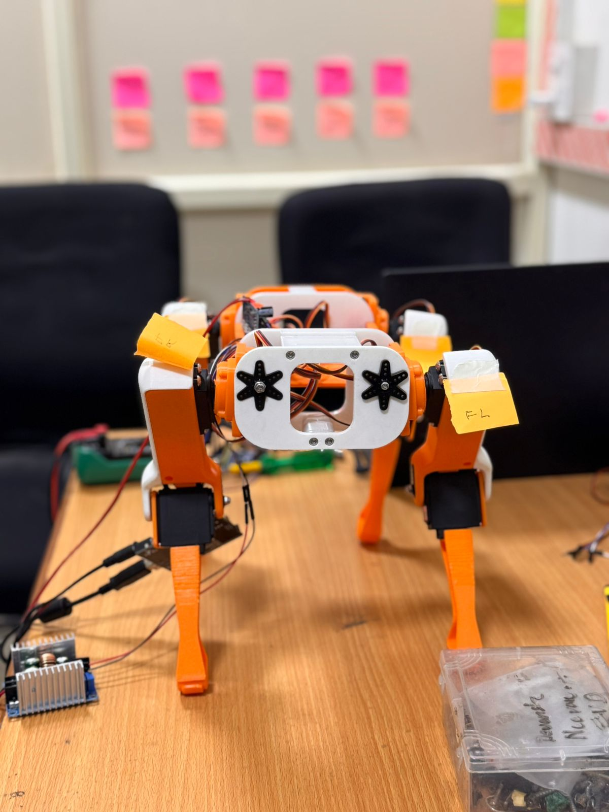
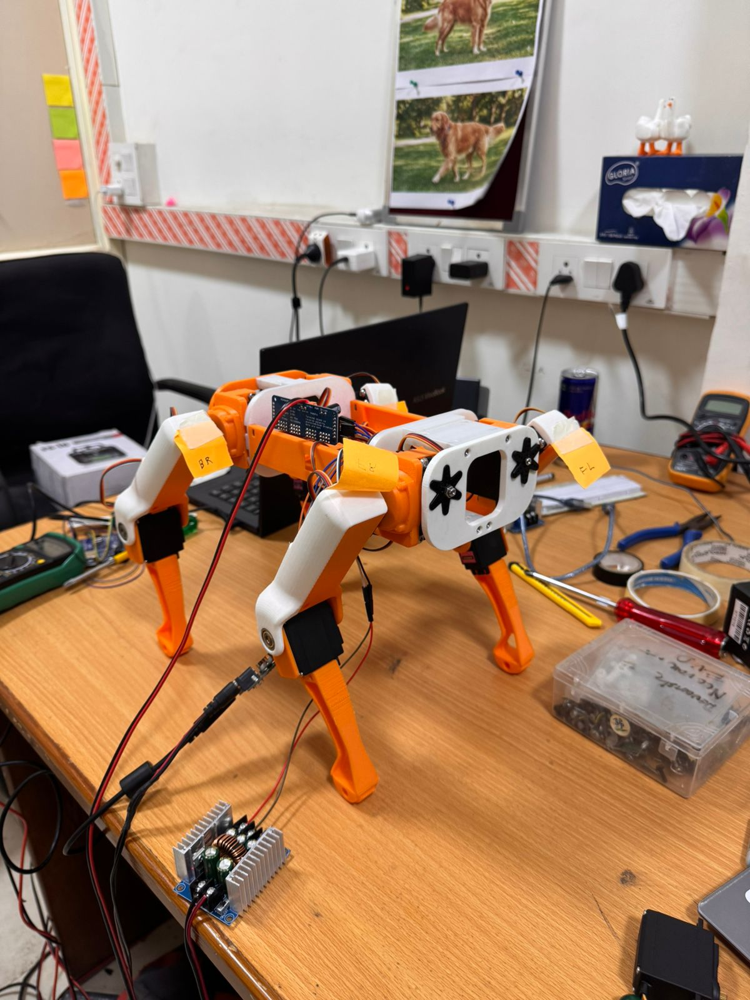
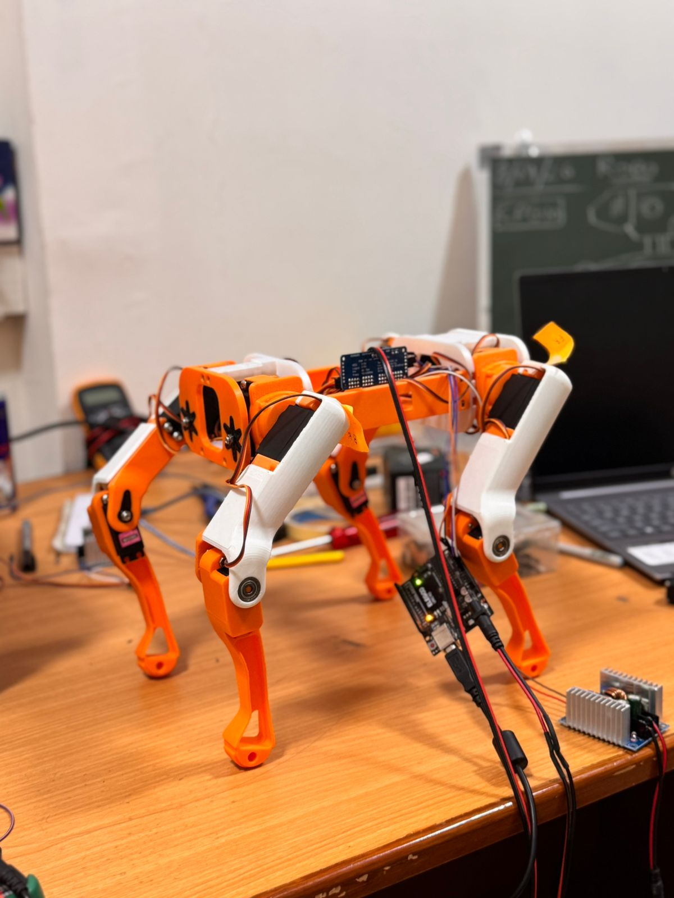

# 🐕 Robotic Dog

A 12-DOF quadruped robot currently under active development.

The objective of this project is to design and build a modular quadruped robot capable of stable locomotion, balancing, and autonomous navigation. The current prototype focuses on mechanical design, electronics integration, hardware bring-up, and validating the platform using an ESP32. After the hardware and low-level software are fully tested, the project will migrate to an STM32-based controller for improved real-time performance and advanced control algorithms.

> **Project Status:** 🚧 Active Development

---

# 📸 Current Prototype

  

  
  

---

# 🎯 Project Objectives

- Design a lightweight and modular quadruped robot
- Develop a stable 12-DOF mechanical platform
- Integrate embedded electronics for motion control
- Validate hardware using ESP32
- Migrate to STM32 for real-time control
- Implement walking gait generation
- Develop self-balancing capabilities
- Integrate environmental sensors
- Build a foundation for autonomous navigation

---

# 📋 Current Hardware

| Component | Current Status |
|------------|----------------|
| 12-DOF Mechanical Design | ✅ Completed |
| 3D Printed Prototype | ✅ Completed |
| Servo Installation | ✅ Completed |
| ESP32 Development Board | ✅ In Use |
| STM32 Controller | ⏳ Planned |
| PCA9685 Servo Driver | ✅ Installed |
| MPU6500 IMU | 🚧 Initial Testing |
| VL53L0X ToF Sensors | ⏳ Planned Integration |
| HC-SR04 Ultrasonic Sensors | ⏳ Planned Integration |
| FSR Foot Sensors | ⏳ Planned Integration |
| ACS758 Current Sensors | ⏳ Planned Integration |
| 3S LiPo Battery | ✅ Selected |

---

# 🚀 Current Development Progress

| Task | Status |
|------|--------|
| Mechanical Design | ✅ |
| CAD Assembly | ✅ |
| 3D Printing | ✅ |
| Robot Assembly | ✅ |
| Electronics Installation | ✅ |
| ESP32 Hardware Bring-up | 🚧 |
| Servo Calibration | 🚧 |
| IMU Integration | ⏳ |
| Standing Posture | ⏳ |
| Walking Gait | ⏳ |
| Balance Controller | ⏳ |
| STM32 Migration | ⏳ |

---

# 📁 Repository Contents

## CAD

Contains the complete 3D CAD model of the robotic dog, including the STEP assembly used for manufacturing and future modifications.

## Code

Contains the source code used during hardware bring-up and embedded software development.

> **Current Status:** Initial ESP32 development and hardware testing.

## Circuit Diagrams

Contains electrical schematics and wiring diagrams used during hardware development.

## Documentation

Contains project reports, design notes, and technical documentation.

## Images

Contains photographs documenting the development of the robot prototype.

## Videos

This folder will contain demonstrations of the robot during future development milestones.

## Datasheets

This folder will contain datasheets for all major electronic components used in the project.

---

# ⚙️ Current Development Focus

The current phase of the project is focused on validating the hardware platform.

Current work includes:

- Hardware bring-up
- Servo testing and calibration
- I²C communication
- Power distribution testing
- Initial IMU testing
- Mechanical refinement

Higher-level software such as inverse kinematics, walking gait generation, and balancing will be developed after the hardware platform has been fully validated.

---

# 🛠️ Software & Tools

### Mechanical Design

- Autodesk Fusion 360

### Embedded Development

- Arduino IDE
- ESP32
- C++

### Manufacturing

- Bambu Lab A1
- PLA Filament

---

# 🗺️ Development Roadmap

## Phase 1 — Mechanical Development

- ✅ Mechanical Design
- ✅ CAD Assembly
- ✅ 3D Printing
- ✅ Prototype Assembly

## Phase 2 — Electronics

- 🚧 ESP32 Integration
- 🚧 Servo Driver Testing
- 🚧 Power System Validation
- 🚧 Sensor Testing

## Phase 3 — Motion Control

- ⏳ Servo Calibration
- ⏳ Standing Posture
- ⏳ Walking Gait

## Phase 4 — Control System

- ⏳ IMU Integration
- ⏳ Balance Controller
- ⏳ Sensor Fusion

## Phase 5 — Platform Upgrade

- ⏳ STM32 Migration
- ⏳ Software Optimization

## Phase 6 — Autonomous Features

- ⏳ Obstacle Detection
- ⏳ Terrain Adaptation
- ⏳ Autonomous Navigation

---

# 📈 Project Timeline

This repository documents the complete engineering journey of the robotic dog, from initial CAD design and hardware prototyping to embedded software development and autonomous locomotion.

Each development milestone will be committed and documented as the project progresses.

---

# 🤝 Contributions

Suggestions, discussions, and constructive feedback are always welcome.

If you have ideas that could improve the mechanical design, embedded software, or overall system architecture, feel free to open an issue or submit a pull request.

---

# 📜 License

This project will be released under the **MIT License**.

> **Note:** The LICENSE file will be added to the repository before the first stable release.

---

# 👨‍💻 Author

**Gourav Jain**

Electronics & Communication Engineering

Interests:
- Robotics
- Embedded Systems
- Computer Vision
- 3D Printing
- Autonomous Robots

---

⭐ **If you find this project interesting, consider giving it a star and following its development.**
