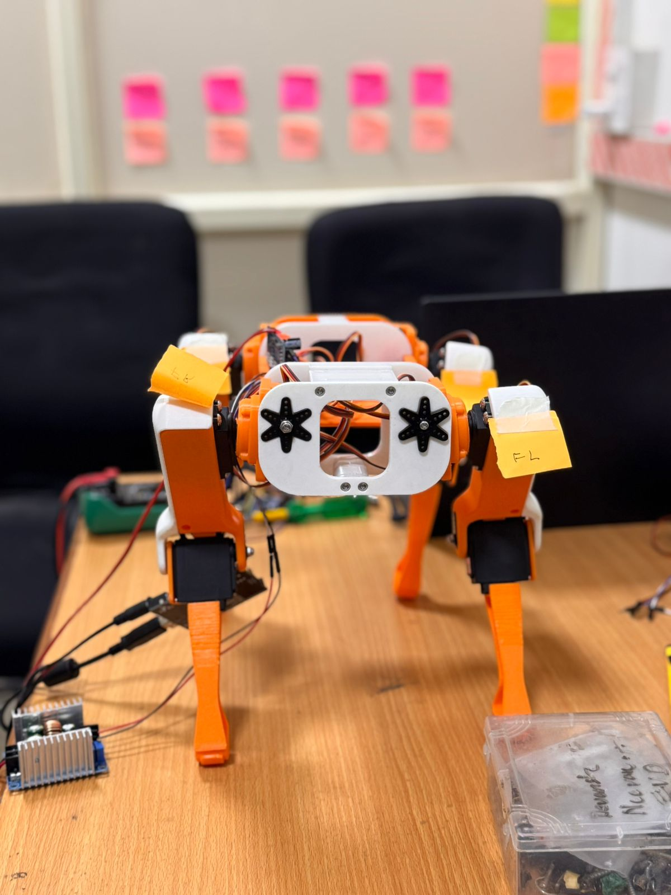
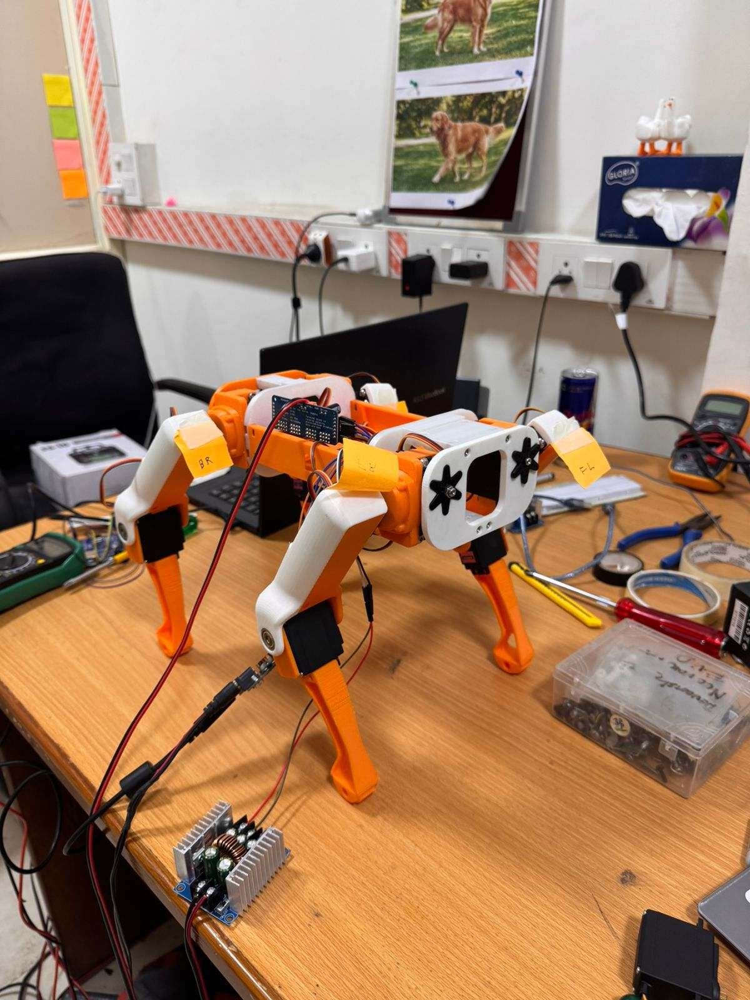
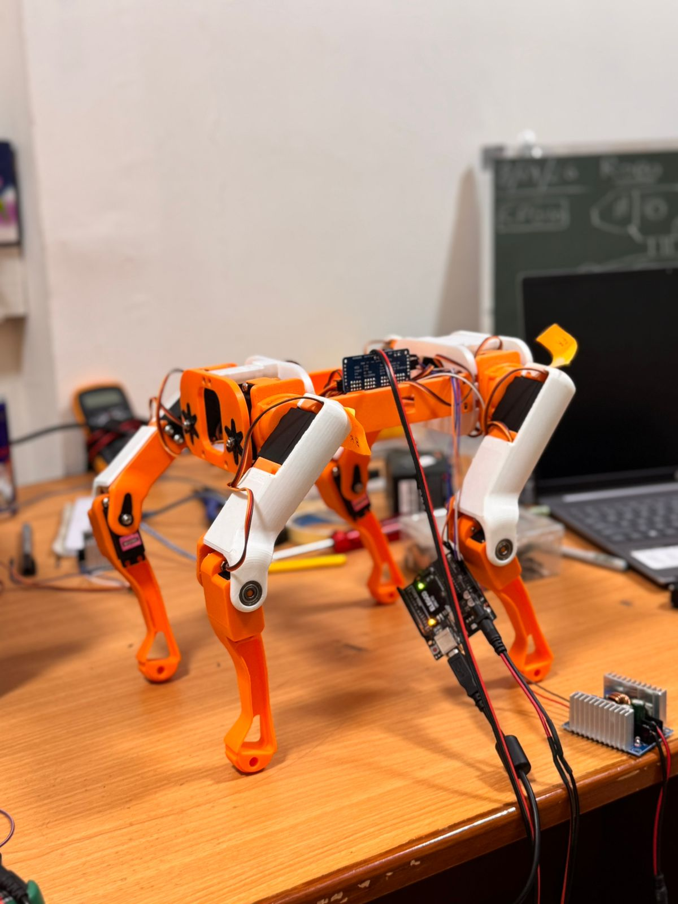

# 🐕 Robotic Dog — 12-DOF Quadruped Robot

A custom-built **12-DOF quadruped robot** designed, CAD-modeled, 3D-printed, and assembled as an ongoing robotics development platform.

The current prototype uses an **ESP32** for low-level hardware development and testing. The system is being developed toward stable quadrupedal locomotion, balance control, perception, and autonomous navigation, with a planned migration to **STM32** for the next-generation low-level controller.

> 🚧 **Project Status:** Active Development  
> **Current Controller:** ESP32  
> **Degrees of Freedom:** 12  
> **Actuators:** 12 Servo Motors  
> **Servo Driver:** PCA9685  
> **Prototype:** 3D-Printed Quadruped

---

## 🎥 Prototype Demonstration

> **Walking demonstration coming soon.**

A short demonstration video will be added here once the robot achieves its first stable walking gait.

<!--
Replace the section above with a GIF/video thumbnail once available.

Example:

<p align="center">
  
</p>
-->

---

## 📸 Current Prototype

<p align="center">
  
</p>

<p align="center">
  
  
</p>

---
## 🎥 Walking Demonstration

First physical locomotion test of the 12-DOF quadruped prototype.

[▶️ Watch the Walking Test](Videos/Robotic_Dog_Walking_Test_1.gif)

# 🤖 What Is This Project?

This project focuses on the development of a **12-DOF quadruped robot** from the mechanical structure up to the embedded control system.

The robot is being developed as a modular platform where the mechanical, electronic, sensing, and control systems can be independently tested and progressively integrated.

The current development strategy is:

```text
Mechanical Design
       ↓
3D Printed Prototype
       ↓
Electronics Integration
       ↓
Hardware Bring-up
       ↓
Servo Calibration
       ↓
Standing Posture
       ↓
Walking Gait
       ↓
Balance Control
       ↓
Sensor Fusion
       ↓
Autonomous Navigation
```

---

# 🔢 Key Specifications

| Parameter | Current Specification |
|-----------|-----------------------|
| Robot Type | Quadruped |
| Degrees of Freedom | 12 |
| Actuators | 12 Servo Motors |
| Current Controller | ESP32 |
| Planned Controller | STM32 |
| Servo Driver | PCA9685 |
| IMU | MPU6500 |
| ToF Sensors | VL53L0X ×2 |
| Ultrasonic Sensors | HC-SR04 ×2 |
| Foot Contact Sensors | FSR ×4 |
| Current Sensors | ACS758 |
| Battery | 3S LiPo |
| Manufacturing | 3D Printing |
| Primary CAD | Autodesk Fusion 360 |

> **Note:** Specifications will be updated as the hardware is finalized and experimentally characterized.

---

# ⚙️ System Architecture

The robot is being developed using a modular hardware architecture.

```text
                    ┌──────────────────────┐
                    │      ESP32           │
                    │  Low-Level Control   │
                    └──────────┬───────────┘
                               │
             ┌─────────────────┼─────────────────┐
             │                 │                 │
             ▼                 ▼                 ▼
       ┌───────────┐     ┌───────────┐     ┌───────────┐
       │ PCA9685   │     │ MPU6500   │     │ Sensors   │
       │ Servo     │     │ IMU       │     │ & Power   │
       │ Driver    │     └───────────┘     └───────────┘
       └─────┬─────┘
             │
             ▼
       ┌──────────────┐
       │ 12 Servos    │
       │ 12-DOF Legs  │
       └──────────────┘
```

The architecture will evolve as higher-level perception and control systems are integrated.

---

# 🦿 Mechanical Design & Analysis

The mechanical system was designed as a **12-DOF quadruped platform**, with three actuated joints per leg.

### Leg Configuration

Each leg consists of:

- Hip joint
- Knee joint
- Ankle joint

```text
             BODY
              │
          ┌───┴───┐
          │       │
        HIP     HIP
          │       │
        KNEE    KNEE
          │       │
       ANKLE    ANKLE
          │       │
         FOOT    FOOT
```

The design was developed with emphasis on:

- Modular assembly
- 3D-printable components
- Servo accessibility
- Compact mechanical structure
- Replaceable components
- Ease of future modification

### CAD

The complete CAD assembly is available in:

```text
CAD/
└── ROBOTIC DOG.step
```

The STEP assembly can be imported into CAD software such as Fusion 360, SolidWorks, or FreeCAD for inspection and further development.

---

## 📐 Mechanical Analysis

The mechanical design will be progressively characterized using measured and calculated engineering parameters.


## 🧪 Structural / FEA Analysis

Finite Element Analysis will be used to identify mechanically critical components and improve the design.

Planned analysis includes:

- Static loading
- Joint mounting stress
- Leg deformation
- Factor of safety
- Critical component identification

FEA results will be added to the repository as the mechanical design is finalized.

---

## 📏 Tolerance & Manufacturing Notes

The robot is manufactured using 3D printing, so dimensional tolerances are important for:

- Servo mounting
- Bearing interfaces
- Screw holes
- Joint alignment
- Press-fit components
- Interlocking parts

Print-specific tolerances and design revisions will be documented as the prototype is iterated.

---

# 💰 Bill of Materials

The project BOM will be updated with actual purchase prices as the hardware inventory is finalized.

| Component | Quantity | Cost |
|-----------|----------|------|
| Servo Motors | 12 | 2400 |
| ESP32 | 1 | 300 |
| PCA9685 | 1 | 250 |
| MPU6500 | 2 | 270 |
| VL53L0X | 2 | 130 |
| HC-SR04 | 2 | 140 |
| FSR | 4 | 1000 |
| ACS758 | 3 | 210 |
| Battery | 1 | 2100 |
| Buck Converters | 3 | 700 |
| 3D Printing Material | — | 900 |
| **Total** | — | **6300** |

> The final BOM cost will be reported after all component prices and manufacturing costs are consolidated.

---

# 💻 Firmware

The current firmware development is based on the ESP32.

The code is organized around individual hardware bring-up tests before integrating the complete robot controller.

```text
Code/
└── ESP32/
    └── Hardware_Bringup/
        ├── FSR/
        ├── Hardware_Bringup/
        ├── MPU6500/
        ├── OLED/
        ├── PCA9685/
        ├── Power_System/
        ├── Servo_Test/
        └── Ultrasonic/
```

Current development focuses on validating each hardware subsystem independently.

---

# 🔌 Hardware Bring-up

The current bring-up process includes testing:

- ESP32
- PCA9685
- Servo motors
- MPU6500
- OLED display
- FSR sensors
- Ultrasonic sensors
- Battery voltage monitoring
- Current monitoring

The individual test programs are available inside:

```text
Code/ESP32/Hardware_Bringup/
```

---

# 📊 Current Development Progress

| Development Stage | Status |
|--------------------|--------|
| Mechanical CAD | ✅ |
| 3D Printed Prototype | ✅ |
| Mechanical Assembly | ✅ |
| Servo Installation | ✅ |
| ESP32 Bring-up | 🚧 |
| Sensor Testing | 🚧 |
| Servo Calibration | 🚧 |
| Standing Posture | ⏳ |
| Walking Gait | ⏳ |
| Balance Controller | ⏳ |
| Sensor Fusion | ⏳ |
| STM32 Migration | ⏳ |
| Autonomous Navigation | ⏳ |

---

# 🗺️ Development Roadmap

### Phase 1 — Mechanical Platform
- ✅ CAD design
- ✅ 3D printing
- ✅ Mechanical assembly
- 🚧 Mechanical optimization

### Phase 2 — Electronics
- 🚧 ESP32 bring-up
- 🚧 Servo testing
- 🚧 Sensor testing
- 🚧 Power monitoring

### Phase 3 — Locomotion
- ⏳ Servo calibration
- ⏳ Standing posture
- ⏳ Weight shifting
- ⏳ Basic gait
- ⏳ Forward walking
- ⏳ Turning

### Phase 4 — Stability
- ⏳ IMU integration
- ⏳ Orientation estimation
- ⏳ Balance controller
- ⏳ Sensor fusion

### Phase 5 — Controller Upgrade
- ⏳ STM32 migration
- ⏳ Real-time control optimization

### Phase 6 — Autonomy
- ⏳ Obstacle detection
- ⏳ Terrain adaptation
- ⏳ Perception
- ⏳ Autonomous navigation

---

# 📈 Performance Metrics

Once the robot reaches stable locomotion, the following parameters will be experimentally measured:

| Metric | Value |
|--------|-------|
| Total Mass | TBD |
| Walking Speed | TBD |
| Battery Runtime | TBD |
| Maximum Payload | TBD |
| Joint Torque | TBD |
| Power Consumption | TBD |
| Walking Efficiency | TBD |

The goal is to replace all `TBD` values with experimentally measured results.

---

# 📁 Repository Structure

```text
Robotic-Dog/
│
├── CAD/
│   ├── ROBOTIC DOG.step
│   └── README.md
│
├── Circuit_Diagrams/
│   ├── Diagram.png
│   └── README.md
│
├── Code/
│   └── ESP32/
│       ├── Hardware_Bringup/
│       │   ├── FSR/
│       │   ├── Hardware_Bringup/
│       │   ├── MPU6500/
│       │   ├── OLED/
│       │   ├── PCA9685/
│       │   ├── Power_System/
│       │   ├── Servo_Test/
│       │   └── Ultrasonic/
│       └── README.md
│
├── Documentation/
│
├── Images/
│
├── Videos/
│
└── README.md
```

---

# 🔬 Engineering Development Philosophy

This project follows an incremental hardware-first development approach.

Each subsystem is tested independently before being integrated into the complete robotic platform.

```text
Component Test
      ↓
Subsystem Validation
      ↓
Integration
      ↓
Calibration
      ↓
Motion Control
      ↓
System Validation
```

This approach helps isolate hardware and software problems before introducing higher-level locomotion algorithms.

---

# 🚧 Current Limitations

The robot is still under active development.

At the current stage:

- Stable walking has not yet been finalized.
- Walking speed and battery life have not yet been experimentally measured.
- Final torque margins are still being calculated.
- FEA analysis is planned for mechanically critical components.
- The STM32 controller migration has not yet been completed.

These values and features will be updated as they are experimentally validated.

---

# 🔮 Future Work

Future development will focus on:

- Stable quadrupedal walking
- Dynamic balance
- Sensor fusion
- Terrain adaptation
- Computer vision
- LiDAR integration
- Autonomous navigation
- STM32-based real-time control
- Higher-level robotic intelligence

---

# 📜 License

This project will be released under the MIT License.

The `LICENSE` file will be added to the repository as the project is prepared for public reuse.

---

# 👨‍💻 Author

**Gourav Jain**

Electronics & Communication Engineering

Interested in:

- Robotics
- Embedded Systems
- Autonomous Systems
- Computer Vision
- 3D Printing
- Robot Control

---

⭐ If you find the project interesting, consider starring the repository and following its development.
